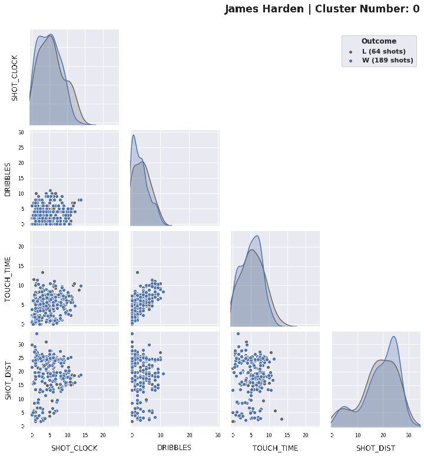

# NBA Shooter Profiler

We provide a tool for game planning by analyzing an opposing player's shot profile.
For instance, for a given player X, we might like to know:
  - From what distances does X tend to shoot the ball?
  - For how long does X tend to hold the ball before shooting?
  - How does X's behavior depend on the shot clock; does their decision making change under stress?
  
Our tool segments X's shots into shot types by clustering, then gives a multi-slice visualization of their shot profile. It also provides a statistical tests of the question:
  "Does X's shot profile differ significantly in wins v.s. in loses?"

We will use the NBA shot logs data available [here](https://www.kaggle.com/dansbecker/nba-shot-logs), which covers around the first 75% of the 2014-2015 season, and which is available locally at [shot_logs.csv](./data/shot_logs.csv). We provide several files documenting our tool.

 - [eda-and-cleaning.md](eda-and-cleaning.md) Basic EDA, followed by a well-documented cleaning of the data in preparation for clustering.
 - [NBA_Shooter_Profiler.ipynb](NBA_Shooter_Profiler.ipynb) A Google Colab notebook performing the cluster analysis. The notebook can also be run interactively by those with a Google account:
 .
 - Example analyses:
   - [Klay Thompson](examples/klay_thompson.md)
   - [Tim Duncan](examples/tim_duncan.md)

