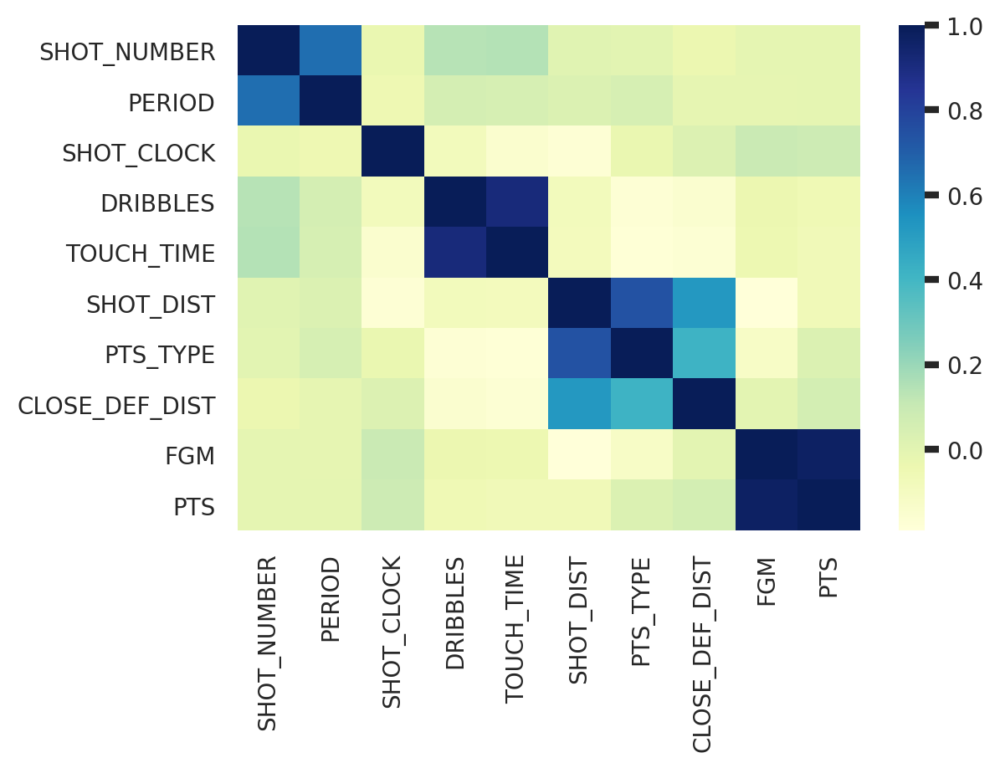
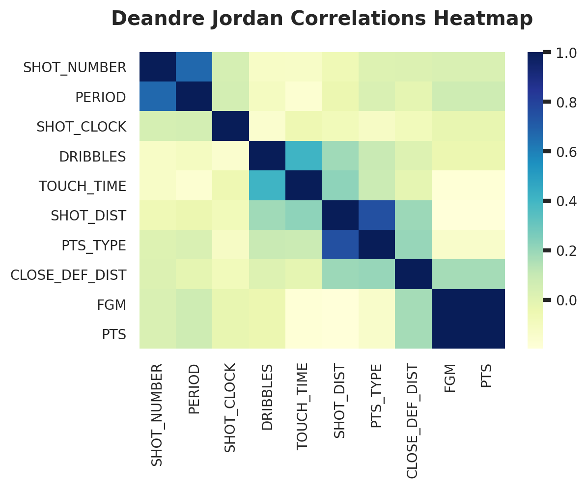

# Table of Contents

1.  [Imports](#org07b735a)
2.  [EDA](#org4221e44)
    1.  [How many games did each team play?](#org7cd6cdb)
    2.  [Correlations](#orgca6f19e)
    3.  [Simple profile: dribbles before shots](#org310f67c)
3.  [Cleaning](#org887c896)
        1.  [Restrict vars and inspect](#org5d40dc9)
        2.  [Missing shot clock values](#org201c4a7)
        3.  [Clip touch times](#org8e880ec)
    1.  [Output data frame](#org38e0da7)
    2.  [Summary of cleaning](#org5cc6aef)

# Imports

    import numpy as np
    import seaborn as sns
    import pandas as pd
    import matplotlib.pyplot as plt
    import re

Set up seaborn

    sns.set(context="notebook",
      rc={"font.size":12, "font.family":"sans-serif", 
          "font.serif":"P052", # note: kills the original list font.serif
          "axes.titlesize":"large", "axes.titlepad":20, 
          "axes.titleweight":"bold",
          "axes.labelsize":"medium", "axes.labelpad":10, 
          "axes.labelweight":"light",  # lighter is not actually an option
          "xtick.labelsize":"small", "ytick.labelsize":"small", 
    #      "axes.facecolor":"white", # vertical axis padding is werid with this
          "legend.fontsize": "medium",
          "xtick.major.width":3, "ytick.major.width":3,
          "legend.loc":"best",
          "figure.dpi":200, "figure.titlesize":"large", 
          "figure.titleweight":"bold"
      }
    )
    
    context: "notebook"

    df = pd.read_csv("../data/shot_logs.csv")
    df

<table border="2" cellspacing="0" cellpadding="6" rules="groups" frame="hsides">

<colgroup>
<col  class="org-right" />

<col  class="org-right" />

<col  class="org-left" />

<col  class="org-left" />

<col  class="org-left" />

<col  class="org-right" />

<col  class="org-right" />

<col  class="org-right" />

<col  class="org-right" />

<col  class="org-right" />

<col  class="org-right" />

<col  class="org-left" />

<col  class="org-right" />

<col  class="org-right" />

<col  class="org-left" />

<col  class="org-left" />

<col  class="org-right" />

<col  class="org-right" />

<col  class="org-right" />

<col  class="org-right" />

<col  class="org-left" />

<col  class="org-right" />
</colgroup>
<thead>
<tr>
<th scope="col" class="org-right">&#xa0;</th>
<th scope="col" class="org-right">GAME_ID</th>
<th scope="col" class="org-left">MATCHUP</th>
<th scope="col" class="org-left">LOCATION</th>
<th scope="col" class="org-left">W</th>
<th scope="col" class="org-right">FINAL_MARGIN</th>
<th scope="col" class="org-right">SHOT_NUMBER</th>
<th scope="col" class="org-right">PERIOD</th>
<th scope="col" class="org-right">GAME_CLOCK</th>
<th scope="col" class="org-right">SHOT_CLOCK</th>
<th scope="col" class="org-right">DRIBBLES</th>
<th scope="col" class="org-left">&#x2026;</th>
<th scope="col" class="org-right">SHOT_DIST</th>
<th scope="col" class="org-right">PTS_TYPE</th>
<th scope="col" class="org-left">SHOT_RESULT</th>
<th scope="col" class="org-left">CLOSEST_DEFENDER</th>
<th scope="col" class="org-right">CLOSEST_DEFENDER_PLAYER_ID</th>
<th scope="col" class="org-right">CLOSE_DEF_DIST</th>
<th scope="col" class="org-right">FGM</th>
<th scope="col" class="org-right">PTS</th>
<th scope="col" class="org-left">player_name</th>
<th scope="col" class="org-right">player_id</th>
</tr>
</thead>

<tbody>
<tr>
<td class="org-right">0</td>
<td class="org-right">21400899</td>
<td class="org-left">MAR 04, 2015 - CHA @ BKN</td>
<td class="org-left">A</td>
<td class="org-left">W</td>
<td class="org-right">24</td>
<td class="org-right">1</td>
<td class="org-right">1</td>
<td class="org-right">1:09</td>
<td class="org-right">10.8</td>
<td class="org-right">2</td>
<td class="org-left">&#x2026;</td>
<td class="org-right">7.7</td>
<td class="org-right">2</td>
<td class="org-left">made</td>
<td class="org-left">Anderson, Alan</td>
<td class="org-right">101187</td>
<td class="org-right">1.3</td>
<td class="org-right">1</td>
<td class="org-right">2</td>
<td class="org-left">brian roberts</td>
<td class="org-right">203148</td>
</tr>

<tr>
<td class="org-right">1</td>
<td class="org-right">21400899</td>
<td class="org-left">MAR 04, 2015 - CHA @ BKN</td>
<td class="org-left">A</td>
<td class="org-left">W</td>
<td class="org-right">24</td>
<td class="org-right">2</td>
<td class="org-right">1</td>
<td class="org-right">0:14</td>
<td class="org-right">3.4</td>
<td class="org-right">0</td>
<td class="org-left">&#x2026;</td>
<td class="org-right">28.2</td>
<td class="org-right">3</td>
<td class="org-left">missed</td>
<td class="org-left">Bogdanovic, Bojan</td>
<td class="org-right">202711</td>
<td class="org-right">6.1</td>
<td class="org-right">0</td>
<td class="org-right">0</td>
<td class="org-left">brian roberts</td>
<td class="org-right">203148</td>
</tr>

<tr>
<td class="org-right">2</td>
<td class="org-right">21400899</td>
<td class="org-left">MAR 04, 2015 - CHA @ BKN</td>
<td class="org-left">A</td>
<td class="org-left">W</td>
<td class="org-right">24</td>
<td class="org-right">3</td>
<td class="org-right">1</td>
<td class="org-right">0:00</td>
<td class="org-right">NaN</td>
<td class="org-right">3</td>
<td class="org-left">&#x2026;</td>
<td class="org-right">10.1</td>
<td class="org-right">2</td>
<td class="org-left">missed</td>
<td class="org-left">Bogdanovic, Bojan</td>
<td class="org-right">202711</td>
<td class="org-right">0.9</td>
<td class="org-right">0</td>
<td class="org-right">0</td>
<td class="org-left">brian roberts</td>
<td class="org-right">203148</td>
</tr>

<tr>
<td class="org-right">3</td>
<td class="org-right">21400899</td>
<td class="org-left">MAR 04, 2015 - CHA @ BKN</td>
<td class="org-left">A</td>
<td class="org-left">W</td>
<td class="org-right">24</td>
<td class="org-right">4</td>
<td class="org-right">2</td>
<td class="org-right">11:47</td>
<td class="org-right">10.3</td>
<td class="org-right">2</td>
<td class="org-left">&#x2026;</td>
<td class="org-right">17.2</td>
<td class="org-right">2</td>
<td class="org-left">missed</td>
<td class="org-left">Brown, Markel</td>
<td class="org-right">203900</td>
<td class="org-right">3.4</td>
<td class="org-right">0</td>
<td class="org-right">0</td>
<td class="org-left">brian roberts</td>
<td class="org-right">203148</td>
</tr>

<tr>
<td class="org-right">4</td>
<td class="org-right">21400899</td>
<td class="org-left">MAR 04, 2015 - CHA @ BKN</td>
<td class="org-left">A</td>
<td class="org-left">W</td>
<td class="org-right">24</td>
<td class="org-right">5</td>
<td class="org-right">2</td>
<td class="org-right">10:34</td>
<td class="org-right">10.9</td>
<td class="org-right">2</td>
<td class="org-left">&#x2026;</td>
<td class="org-right">3.7</td>
<td class="org-right">2</td>
<td class="org-left">missed</td>
<td class="org-left">Young, Thaddeus</td>
<td class="org-right">201152</td>
<td class="org-right">1.1</td>
<td class="org-right">0</td>
<td class="org-right">0</td>
<td class="org-left">brian roberts</td>
<td class="org-right">203148</td>
</tr>

<tr>
<td class="org-right">&#x2026;</td>
<td class="org-right">&#x2026;</td>
<td class="org-left">&#x2026;</td>
<td class="org-left">&#x2026;</td>
<td class="org-left">&#x2026;</td>
<td class="org-right">&#x2026;</td>
<td class="org-right">&#x2026;</td>
<td class="org-right">&#x2026;</td>
<td class="org-right">&#x2026;</td>
<td class="org-right">&#x2026;</td>
<td class="org-right">&#x2026;</td>
<td class="org-left">&#x2026;</td>
<td class="org-right">&#x2026;</td>
<td class="org-right">&#x2026;</td>
<td class="org-left">&#x2026;</td>
<td class="org-left">&#x2026;</td>
<td class="org-right">&#x2026;</td>
<td class="org-right">&#x2026;</td>
<td class="org-right">&#x2026;</td>
<td class="org-right">&#x2026;</td>
<td class="org-left">&#x2026;</td>
<td class="org-right">&#x2026;</td>
</tr>

<tr>
<td class="org-right">128064</td>
<td class="org-right">21400006</td>
<td class="org-left">OCT 29, 2014 - BKN @ BOS</td>
<td class="org-left">A</td>
<td class="org-left">L</td>
<td class="org-right">-16</td>
<td class="org-right">5</td>
<td class="org-right">3</td>
<td class="org-right">1:52</td>
<td class="org-right">18.3</td>
<td class="org-right">5</td>
<td class="org-left">&#x2026;</td>
<td class="org-right">8.7</td>
<td class="org-right">2</td>
<td class="org-left">missed</td>
<td class="org-left">Smart, Marcus</td>
<td class="org-right">203935</td>
<td class="org-right">0.8</td>
<td class="org-right">0</td>
<td class="org-right">0</td>
<td class="org-left">jarrett jack</td>
<td class="org-right">101127</td>
</tr>

<tr>
<td class="org-right">128065</td>
<td class="org-right">21400006</td>
<td class="org-left">OCT 29, 2014 - BKN @ BOS</td>
<td class="org-left">A</td>
<td class="org-left">L</td>
<td class="org-right">-16</td>
<td class="org-right">6</td>
<td class="org-right">4</td>
<td class="org-right">11:28</td>
<td class="org-right">19.8</td>
<td class="org-right">4</td>
<td class="org-left">&#x2026;</td>
<td class="org-right">0.6</td>
<td class="org-right">2</td>
<td class="org-left">made</td>
<td class="org-left">Turner, Evan</td>
<td class="org-right">202323</td>
<td class="org-right">0.6</td>
<td class="org-right">1</td>
<td class="org-right">2</td>
<td class="org-left">jarrett jack</td>
<td class="org-right">101127</td>
</tr>

<tr>
<td class="org-right">128066</td>
<td class="org-right">21400006</td>
<td class="org-left">OCT 29, 2014 - BKN @ BOS</td>
<td class="org-left">A</td>
<td class="org-left">L</td>
<td class="org-right">-16</td>
<td class="org-right">7</td>
<td class="org-right">4</td>
<td class="org-right">11:10</td>
<td class="org-right">23.0</td>
<td class="org-right">2</td>
<td class="org-left">&#x2026;</td>
<td class="org-right">16.9</td>
<td class="org-right">2</td>
<td class="org-left">made</td>
<td class="org-left">Thornton, Marcus</td>
<td class="org-right">201977</td>
<td class="org-right">4.2</td>
<td class="org-right">1</td>
<td class="org-right">2</td>
<td class="org-left">jarrett jack</td>
<td class="org-right">101127</td>
</tr>

<tr>
<td class="org-right">128067</td>
<td class="org-right">21400006</td>
<td class="org-left">OCT 29, 2014 - BKN @ BOS</td>
<td class="org-left">A</td>
<td class="org-left">L</td>
<td class="org-right">-16</td>
<td class="org-right">8</td>
<td class="org-right">4</td>
<td class="org-right">2:37</td>
<td class="org-right">9.1</td>
<td class="org-right">4</td>
<td class="org-left">&#x2026;</td>
<td class="org-right">18.3</td>
<td class="org-right">2</td>
<td class="org-left">missed</td>
<td class="org-left">Bradley, Avery</td>
<td class="org-right">202340</td>
<td class="org-right">3.0</td>
<td class="org-right">0</td>
<td class="org-right">0</td>
<td class="org-left">jarrett jack</td>
<td class="org-right">101127</td>
</tr>

<tr>
<td class="org-right">128068</td>
<td class="org-right">21400006</td>
<td class="org-left">OCT 29, 2014 - BKN @ BOS</td>
<td class="org-left">A</td>
<td class="org-left">L</td>
<td class="org-right">-16</td>
<td class="org-right">9</td>
<td class="org-right">4</td>
<td class="org-right">0:12</td>
<td class="org-right">NaN</td>
<td class="org-right">5</td>
<td class="org-left">&#x2026;</td>
<td class="org-right">5.1</td>
<td class="org-right">2</td>
<td class="org-left">made</td>
<td class="org-left">Bradley, Avery</td>
<td class="org-right">202340</td>
<td class="org-right">2.3</td>
<td class="org-right">1</td>
<td class="org-right">2</td>
<td class="org-left">jarrett jack</td>
<td class="org-right">101127</td>
</tr>
</tbody>
</table>

128069 rows × 21 columns

# EDA

## How many games did each team play?

The GAME_ID is formatted in one of two ways, depending ont the value of LOCATION:

-   AWAY @ HOME if the game was a home game for the player (i.e., LOCATION=H)
-   HOME vs. AWAY if the game was an away game for the player (i.e., LOCATION=A)

Therefore, the team of the shooter in question is always listed first.

We find of the distinct values GAME_ID and record the corresponding matchup.

    # The away team takes a shot in every game, 
    # so we can throw out half of the entries.
    ddf = df[df.LOCATION=="A"]
    ddf = ddf.assign(AWAY_TEAM=lambda ddf: ddf.MATCHUP.apply(lambda s: s[-9:-6]))
    ddf = ddf.assign(HOME_TEAM=lambda ddf: ddf.MATCHUP.apply(lambda s: s[-3:]))
    ddf = ddf[["GAME_ID", "AWAY_TEAM", "HOME_TEAM"]].drop_duplicates()
    print(ddf)
    print(f"Compare with df.GAME_ID.nunique() = {df.GAME_ID.nunique()}.")

             GAME_ID AWAY_TEAM HOME_TEAM
    0       21400899       CHA       BKN
    13      21400882       CHA       ORL
    14      21400859       CHA       BOS
    19      21400845       CHA       CHI
    27      21400827       CHA       DAL
    ...          ...       ...       ...
    124505  21400374       BKN       TOR
    124668  21400033       BKN       DET
    124675  21400006       BKN       BOS
    124972  21400341       BKN       CHA
    124994  21400320       BKN       CHI
    
    [904 rows x 3 columns]
    Compare with df.GAME_ID.nunique() = 904.

Many games are missing. There are 82\*30/2 = 1230 games in the regular season.

Aggregate by team

    # count games played by a given team with abbreviation ab
    team_abbrevs = df.MATCHUP.apply(lambda s: s[-3:]).unique()
    num_games = np.vectorize(lambda ab: ddf[(ddf.HOME_TEAM == ab) | (ddf.AWAY_TEAM == ab)].shape[0])
    pd.DataFrame({"games_played": num_games(team_abbrevs)}, index=team_abbrevs).T

<table border="2" cellspacing="0" cellpadding="6" rules="groups" frame="hsides">

<colgroup>
<col  class="org-left" />

<col  class="org-right" />

<col  class="org-right" />

<col  class="org-right" />

<col  class="org-right" />

<col  class="org-right" />

<col  class="org-right" />

<col  class="org-right" />

<col  class="org-right" />

<col  class="org-right" />

<col  class="org-right" />

<col  class="org-left" />

<col  class="org-right" />

<col  class="org-right" />

<col  class="org-right" />

<col  class="org-right" />

<col  class="org-right" />

<col  class="org-right" />

<col  class="org-right" />

<col  class="org-right" />

<col  class="org-right" />

<col  class="org-right" />
</colgroup>
<thead>
<tr>
<th scope="col" class="org-left">&#xa0;</th>
<th scope="col" class="org-right">BKN</th>
<th scope="col" class="org-right">LAL</th>
<th scope="col" class="org-right">ORL</th>
<th scope="col" class="org-right">BOS</th>
<th scope="col" class="org-right">CHI</th>
<th scope="col" class="org-right">DAL</th>
<th scope="col" class="org-right">OKC</th>
<th scope="col" class="org-right">DET</th>
<th scope="col" class="org-right">IND</th>
<th scope="col" class="org-right">PHI</th>
<th scope="col" class="org-left">&#x2026;</th>
<th scope="col" class="org-right">MIL</th>
<th scope="col" class="org-right">UTA</th>
<th scope="col" class="org-right">PHX</th>
<th scope="col" class="org-right">MEM</th>
<th scope="col" class="org-right">ATL</th>
<th scope="col" class="org-right">GSW</th>
<th scope="col" class="org-right">POR</th>
<th scope="col" class="org-right">LAC</th>
<th scope="col" class="org-right">SAC</th>
<th scope="col" class="org-right">CHA</th>
</tr>
</thead>

<tbody>
<tr>
<td class="org-left">games_played</td>
<td class="org-right">59</td>
<td class="org-right">60</td>
<td class="org-right">62</td>
<td class="org-right">59</td>
<td class="org-right">61</td>
<td class="org-right">62</td>
<td class="org-right">61</td>
<td class="org-right">60</td>
<td class="org-right">60</td>
<td class="org-right">61</td>
<td class="org-left">&#x2026;</td>
<td class="org-right">60</td>
<td class="org-right">60</td>
<td class="org-right">62</td>
<td class="org-right">60</td>
<td class="org-right">60</td>
<td class="org-right">59</td>
<td class="org-right">59</td>
<td class="org-right">62</td>
<td class="org-right">59</td>
<td class="org-right">59</td>
</tr>
</tbody>
</table>

1 rows × 30 columns

Find the dates of the games played.

    rgx = re.compile("^(.*\d{1})") # capture date part of the values of MATCHUP.
    dates = df.MATCHUP.apply(lambda s: re.match(rgx, s).group(1)).drop_duplicates()
    dates = pd.to_datetime(dates).to_frame() # sort and produce frame.
    dates.sort_values(by="MATCHUP").reset_index(drop=True)

<table border="2" cellspacing="0" cellpadding="6" rules="groups" frame="hsides">

<colgroup>
<col  class="org-right" />

<col  class="org-right" />
</colgroup>
<thead>
<tr>
<th scope="col" class="org-right">&#xa0;</th>
<th scope="col" class="org-right">MATCHUP</th>
</tr>
</thead>

<tbody>
<tr>
<td class="org-right">0</td>
<td class="org-right">2014-10-28</td>
</tr>

<tr>
<td class="org-right">1</td>
<td class="org-right">2014-10-29</td>
</tr>

<tr>
<td class="org-right">2</td>
<td class="org-right">2014-10-30</td>
</tr>

<tr>
<td class="org-right">3</td>
<td class="org-right">2014-10-31</td>
</tr>

<tr>
<td class="org-right">4</td>
<td class="org-right">2014-11-01</td>
</tr>

<tr>
<td class="org-right">&#x2026;</td>
<td class="org-right">&#x2026;</td>
</tr>

<tr>
<td class="org-right">115</td>
<td class="org-right">2015-02-28</td>
</tr>

<tr>
<td class="org-right">116</td>
<td class="org-right">2015-03-01</td>
</tr>

<tr>
<td class="org-right">117</td>
<td class="org-right">2015-03-02</td>
</tr>

<tr>
<td class="org-right">118</td>
<td class="org-right">2015-03-03</td>
</tr>

<tr>
<td class="org-right">119</td>
<td class="org-right">2015-03-04</td>
</tr>
</tbody>
</table>

120 rows × 1 columns

## Correlations

We show the correlations between all of the relevant (dropping numerical ID's) variables across the entire dataset.

    drop_vars = ['GAME_ID', 'MATCHUP', 'LOCATION', 'W', 
                 'FINAL_MARGIN', 'CLOSEST_DEFENDER', 
                 'CLOSEST_DEFENDER_PLAYER_ID', 
                 'player_name', 'player_id']
    ddf = df.drop(drop_vars, axis=1)
    
    _ = sns.heatmap(ddf.corr(), cmap="YlGnBu")

We see a number of expected correlations. For example: 

-   There is a weak correlation between shot distance and closest defender distance. This is because challenging a player at the basket requires closer coverage than covering a player shooting from farther out.
-   We see a strong correlation between dribbles and touch time. This is because, in  This is to be expected, since, typically, longer touch times require more dribbles from the player, and, conversely, a larger number of dribbles tends to indicate a longer touch time.

For players near the basket (at least), it can happen that DRIBBLES and TOUCH_TIME
are less strongly correlated. E.g., Anthony Davis in losses, Tyson Chandler in wins.

    def plot_player_heatmap(pname):
        ddf = df[(df.player_name==pname)]
        ddf =ddf.drop(drop_vars, axis=1)
        g = sns.heatmap(ddf.corr(), cmap="YlGnBu")
        _ = g.set_title(f"{pname.title()} Correlations Heatmap")
        return g
    
    pname = "stephen curry"
    _ = plot_player_heatmap(pname)

    pname = "deandre jordan"
    _ = plot_player_heatmap(pname)

## Simple profile: dribbles before shots

A very simple characteristic of a player's shot profile is their tendency to take dribbles. For instance, some players tend to create shots for themselves by moving around with the ball, while others tend to move with the ball and shoot shortly after catching a pass. 

We compare James Harden, a player who frequently handles the ball for a long time before shooting, with Joe Ingles, who is more of a catch-and-shoot player. 

    # Note: there is an error in the dataset: "jon ingles" is really "joe ingles"
    # We will fix that here and again, alter, when we prepare the data for clustering.
    
    def jon_to_joe(name):
        if name == "jon ingles":
            return "joe ingles"
        else:
            return name
    df.player_name = df.player_name.apply(jon_to_joe)
    
    players = ["james harden", "joe ingles"]

    def compare_dribbles(players, norm_hist = False):
        fig, ax = plt.subplots()
    
        list(map(lambda s: 
                 sns.distplot(df[df.player_name==s].DRIBBLES, 
                              bins=range(31), kde=False, 
                              label=s.title(), norm_hist=norm_hist), 
                 players))
    
        plt.xlabel('Dribbles')
        if norm_hist:
            plt.ylabel('%')
            title_string = "Percentage of shots taken after a given number of dribbles"
        else:
            plt.ylabel('Shots')
            title_string = "Number of shots taken after a given number of dribbles"
        plt.legend()
    
        plt.title(title_string)
    compare_dribbles(players, norm_hist=False)

    compare_dribbles(players, norm_hist=True)

# Cleaning

### Restrict vars and inspect

We will try understand how a shooter's shot selection, described in terms of a restricted set of variables, is a good predictor of a win or loss for the team. We expect that this can only be the case for players that are one of the most important players on their team.

    keep_vars = ["GAME_ID", "W", "SHOT_CLOCK", 
                 "GAME_CLOCK", "DRIBBLES", "TOUCH_TIME", 
                 "SHOT_DIST", "player_name"]
    cluster_vars = ["SHOT_CLOCK", 
                    "DRIBBLES", 
                    "TOUCH_TIME", 
                    "SHOT_DIST"]
    df = df[keep_vars]

We check to see which columns contain a missing value.

    print(df.isna().any())

    GAME_ID        False
    W              False
    SHOT_CLOCK      True
    GAME_CLOCK     False
    DRIBBLES       False
    TOUCH_TIME     False
    SHOT_DIST      False
    player_name    False
    dtype: bool

There are missing values of SHOT_CLOCK, and not of any other variable. These come both from the clock being turned off at the time of the shot (this is resolvable by using the game clock at the time) and from the values simply being missing (I have often seen shot clocks malfunction while watching a game).

How prevalent is this problem?

    df_na = df[df.SHOT_CLOCK.isna()] # frame of rows from df with missing SHOT_CLOCK value
    num_na = df_na.shape[0]
    print(f"There are {num_na} rows out of 128069", 
          f"({np.round(100*num_na/df.shape[0], 1)}%)", 
          "with a missing value of SHOT_CLOCK.")

    There are 5567 rows out of 128069 (4.3%) with a missing value of SHOT_CLOCK.

Here is a basic description of the variables we intend to use for clustering:

    print(df[cluster_vars].describe())

              SHOT_CLOCK       DRIBBLES     TOUCH_TIME      SHOT_DIST
    count  122502.000000  128069.000000  128069.000000  128069.000000
    mean       12.453344       2.023355       2.765901      13.571504
    std         5.763265       3.477760       3.043682       8.888964
    min         0.000000       0.000000    -163.600000       0.000000
    25%         8.200000       0.000000       0.900000       4.700000
    50%        12.300000       1.000000       1.600000      13.700000
    75%        16.675000       2.000000       3.700000      22.500000
    max        24.000000      32.000000      24.900000      47.200000

Everything seems to be in order except for some missing SHOT_CLOCK values and the existence of some negative values of TOUCH_TIME. How many such values exist?

    df_neg = df[df.TOUCH_TIME<0]
    print("The number of negative negative TOUCH_TIME",
          f"values is {df_neg.shape[0]}.")
    df_neg.nunique()

    The number of negative negative TOUCH_TIME values is 312.
    GAME_ID        249
    W                2
    SHOT_CLOCK     148
    GAME_CLOCK     257
    DRIBBLES         2
    TOUCH_TIME      72
    SHOT_DIST      164
    player_name    163
    dtype: int64

We see that the problem of negative touch times is prevalent: it occurs in 249/904 games, in a variety of SHOT_CLOCK/GAME_CLOCK settings. However, it only occurs for two values of DRIBBLES:

    df_neg.DRIBBLES.value_counts()

    0    311
    2      1
    Name: DRIBBLES, dtype: int64

### Missing shot clock values

1.  Replace GAME_CLOCK column

    What does GAME_CLOCK look like when SHOT_CLOCK is nan? Values of the variable GAME_CLOCK are times in the form mm:ss. We convert those times to seconds.
    
        def mmss_to_sec(s):  # is a series who entires are strings of times of the form "mm:ss"
            ddf = s.str.split(":", expand=True)
            ddf = ddf.astype(int)
            return ddf[0]*60 + ddf[1]
        df = df.assign(GAME_CLOCK=mmss_to_sec(df.GAME_CLOCK))
        df_na = df_na.assign(GAME_CLOCK=mmss_to_sec(df_na.GAME_CLOCK))
    
    I treat those missing values with GAME_CLOCK <= 24 as uncontroversial with regard to how they should be imputed. In such cases, the shot clock is turned off. I'll fill those by using the game clock value. The remaining values are controversial:
    
        contro = df_na[df_na.GAME_CLOCK>24]
        print(f"There are {contro.shape[0]} controversial rows.")
        contro.nunique()
    
        There are 2013 controversial rows.
        GAME_ID         35
        W                2
        SHOT_CLOCK       0
        GAME_CLOCK     655
        DRIBBLES        25
        TOUCH_TIME     139
        SHOT_DIST      285
        player_name    175
        dtype: int64

2.  Analysis of controversial shots

    How many controversial shots are there in each game?
    
        vcs = pd.DataFrame(contro.GAME_ID.value_counts())
        vcs = vcs.rename(columns={"GAME_ID":"# missing"})
        vcs.index.name = "GAME_ID"
        print(vcs)
    
                  # missing
        GAME_ID            
        21400339        169
        21400579        149
        21400115        141
        21400616        138
        21400648        135
        21400032        133
        21400084        129
        21400675        121
        21400088        118
        21400300         84
        21400494         72
        21400562         72
        21400815         71
        21400787         69
        21400667         69
        21400548         68
        21400680         68
        21400868         62
        21400538         40
        21400449         31
        21400169         18
        21400692         12
        21400813         10
        21400814         10
        21400741          6
        21400086          5
        21400907          5
        21400159          1
        21400344          1
        21400400          1
        21400625          1
        21400066          1
        21400761          1
        21400031          1
        21400001          1
    
    In the worst case, Game 21400339, almost all of the shots have a missing SHOT_CLOCK value:
    
        bad_ID = 21400339
        num_total = df[df.GAME_ID==bad_ID].shape[0]
        num_missing = contro[contro.GAME_ID==bad_ID].shape[0]
        print(f"In game {bad_ID}, {num_missing} shots", 
              f"out of {num_total} have a missing value",
              "of SHOT_CLOCK.")
    
        In game 21400339, 169 shots out of 179 have a missing value of SHOT_CLOCK.
    
    What about a game with only a few controversial rows?
    
        contro[contro.GAME_ID == 21400741]
    
    <table border="2" cellspacing="0" cellpadding="6" rules="groups" frame="hsides">
    
    
    <colgroup>
    <col  class="org-right" />
    
    <col  class="org-right" />
    
    <col  class="org-left" />
    
    <col  class="org-right" />
    
    <col  class="org-right" />
    
    <col  class="org-right" />
    
    <col  class="org-right" />
    
    <col  class="org-right" />
    
    <col  class="org-left" />
    </colgroup>
    <thead>
    <tr>
    <th scope="col" class="org-right">&#xa0;</th>
    <th scope="col" class="org-right">GAME_ID</th>
    <th scope="col" class="org-left">W</th>
    <th scope="col" class="org-right">SHOT_CLOCK</th>
    <th scope="col" class="org-right">GAME_CLOCK</th>
    <th scope="col" class="org-right">DRIBBLES</th>
    <th scope="col" class="org-right">TOUCH_TIME</th>
    <th scope="col" class="org-right">SHOT_DIST</th>
    <th scope="col" class="org-left">player_name</th>
    </tr>
    </thead>
    
    <tbody>
    <tr>
    <td class="org-right">13859</td>
    <td class="org-right">21400741</td>
    <td class="org-left">W</td>
    <td class="org-right">NaN</td>
    <td class="org-right">594</td>
    <td class="org-right">2</td>
    <td class="org-right">2.1</td>
    <td class="org-right">6.8</td>
    <td class="org-left">leandro barbosa</td>
    </tr>
    
    
    <tr>
    <td class="org-right">16053</td>
    <td class="org-right">21400741</td>
    <td class="org-left">W</td>
    <td class="org-right">NaN</td>
    <td class="org-right">593</td>
    <td class="org-right">0</td>
    <td class="org-right">0.0</td>
    <td class="org-right">3.2</td>
    <td class="org-left">marreese speights</td>
    </tr>
    
    
    <tr>
    <td class="org-right">16056</td>
    <td class="org-right">21400741</td>
    <td class="org-left">W</td>
    <td class="org-right">NaN</td>
    <td class="org-right">373</td>
    <td class="org-right">0</td>
    <td class="org-right">0.0</td>
    <td class="org-right">2.6</td>
    <td class="org-left">marreese speights</td>
    </tr>
    
    
    <tr>
    <td class="org-right">17067</td>
    <td class="org-right">21400741</td>
    <td class="org-left">W</td>
    <td class="org-right">NaN</td>
    <td class="org-right">458</td>
    <td class="org-right">0</td>
    <td class="org-right">1.1</td>
    <td class="org-right">24.2</td>
    <td class="org-left">andre iguodala</td>
    </tr>
    
    
    <tr>
    <td class="org-right">37940</td>
    <td class="org-right">21400741</td>
    <td class="org-left">L</td>
    <td class="org-right">NaN</td>
    <td class="org-right">570</td>
    <td class="org-right">0</td>
    <td class="org-right">0.8</td>
    <td class="org-right">25.5</td>
    <td class="org-left">charlie villanueva</td>
    </tr>
    
    
    <tr>
    <td class="org-right">38437</td>
    <td class="org-right">21400741</td>
    <td class="org-left">L</td>
    <td class="org-right">NaN</td>
    <td class="org-right">383</td>
    <td class="org-right">1</td>
    <td class="org-right">2.9</td>
    <td class="org-right">2.2</td>
    <td class="org-left">chandler parsons</td>
    </tr>
    </tbody>
    </table>
    
    Among these, we see that some have short touch time, or few dribbles, or short distance. This suggests that some were shot before the shot clock reset.
    
        num_contro = contro.shape[0]
        num_short = contro[(contro.TOUCH_TIME<4)].shape[0]
        print(f"{num_short} out of {num_contro} outstanding",
              f"shots have a touch time of <4 seconds.")
    
        1591 out of 2013 outstanding shots have a touch time of <4 seconds.
    
    We conclude ~75% of the controversial values have a short touch time, suggesting a missed shot clock reset.

3.  Less conservative policy:

    -   Drop those games with > 10? 20? contraversial rows. For the rest: 
        -   If GAME_CLOCK =< 24: fill SHOT_CLOCK using GAME_CLOCK;
        -   If DRIBBLES < 5?: assume the clock didn't reset, 
            and set SHOT_CLOCK = 24 - TOUCH_TIME.
    
    Note: the last part of this is a bad polciy in more recent seasons, when the shot clock would only reset to 14 after an offensive rebound.

4.  Most conservative policy

    -   Drop all 35 games with a controversial value.
    
    The benefit of this policy is that it would allows us to conduct a game-by-game analysis for each player. We don't do this in our shot profiling application, so we opt not to use this policy since it would drop a large number of useful datapoints:
    
        num_shots = sum(df.GAME_ID.isin(contro.GAME_ID.unique()))
        print(f"This policy would drop {num_shots} shots.")
    
        This policy would drop 5110 shots.

5.  Our policy:

    We will follow this policy for resolving missing SHOT_CLOCK values:
    
    -   Drop controversial rows.
    -   For the remaining rows, GAME_CLOCK =< 24. For these, fill SHOT_CLOCK using GAME_CLOCK.
    
        df = df.drop(contro.index)
        GC_vals = df[df.SHOT_CLOCK.isna()].GAME_CLOCK.unique()
        print("For the remaining missing values," 
              f"the game clock is <= {GC_vals.max()}")
    
        For the remaining missing values,the game clock is <= 24
    
    We now fill the remaining missing values with 0:
    
        new_SHOT_CLOCK = df.SHOT_CLOCK.fillna(df.GAME_CLOCK)
        df = df.assign(SHOT_CLOCK = new_SHOT_CLOCK)
    
    We check each column to verify that there are no missing values:
    
        print(df.isna().any())
    
        GAME_ID        False
        W              False
        SHOT_CLOCK     False
        GAME_CLOCK     False
        DRIBBLES       False
        TOUCH_TIME     False
        SHOT_DIST      False
        player_name    False
        dtype: bool

### Clip touch times

    print(f"There are {sum(df.TOUCH_TIME==0)} shots with TOUCH_TIME==0.")

    There are 2985 shots with TOUCH_TIME==0.

We saw before that all but one of the shots with negative touch time was preceded by zero dribbles (like a catch-and-shoot or tip-in situation). Since TOUCH_TIME==0 occurs naturally in the dataset, it is natural to clip negative touch times from below to 0 whenever those shots were preceded by zero dribbles. This leaves only one outstanding row:

    df[(df.TOUCH_TIME<0)&(df.DRIBBLES>0)].iloc[0]

    GAME_ID            21400821
    W                         W
    SHOT_CLOCK               23
    GAME_CLOCK              337
    DRIBBLES                  2
    TOUCH_TIME             -0.1
    SHOT_DIST              24.2
    player_name    kyrie irving
    Name: 44723, dtype: object

The one shot with two dribbles looks like a touch time of 1 second&#x2013;the shot clock was at 23. Hence we can reasonably set all of these touch times to zero, or possibly set the exceptional shot's touch time to 1 second. I'll just set them all to 0:

    masked_TOUCH_TIME = df.TOUCH_TIME.mask(df.TOUCH_TIME<0, 0)
    df = df.assign(TOUCH_TIME=masked_TOUCH_TIME)

## Output data frame

    print(f"Exporting a dataframe of shape {df.shape} to csv.")
    df.to_csv("../data/shot_logs_prepped.csv", index=False)

    Exporting a dataframe of shape (126056, 8) to csv.

## Summary of cleaning

-   We kept the variables:
    ["GAME_ID", "W", "SHOT_CLOCK", 
     "GAME_CLOCK", "DRIBBLES", "TOUCH_TIME", 
     "SHOT_DIST", "player_name"]

-   We converted GAME_CLOCK from strings to ints (unit: seconds).

-   We filled handled missing SHOT_CLOCK values by:
    -   Replacing SHOT_CLOCK by GAME_CLOCK whenever GAME_CLOCK<=24.
    -   Dropping the remaining rows (2013/128069; 1.6% of the data) .

-   We clipped negative touch times to 0.

