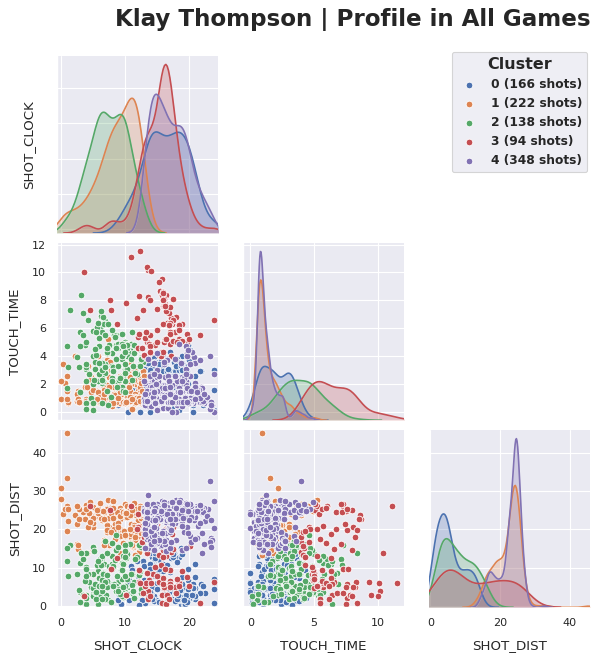
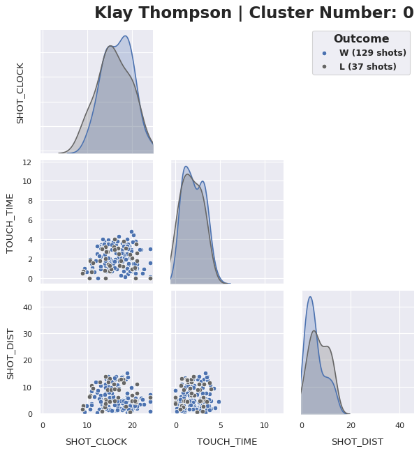
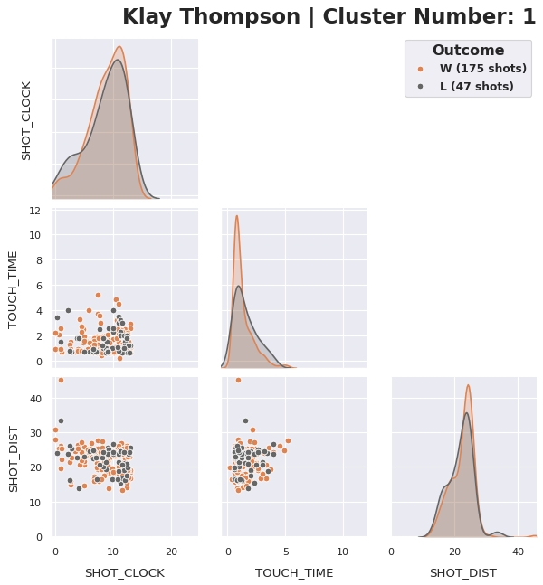
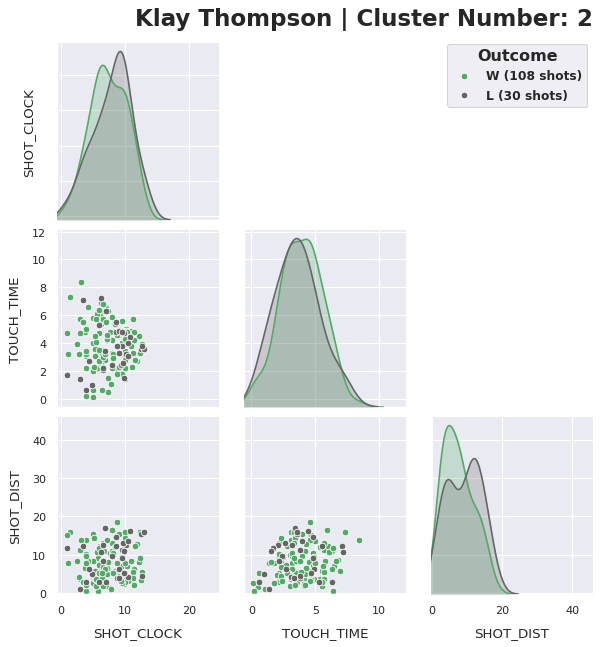
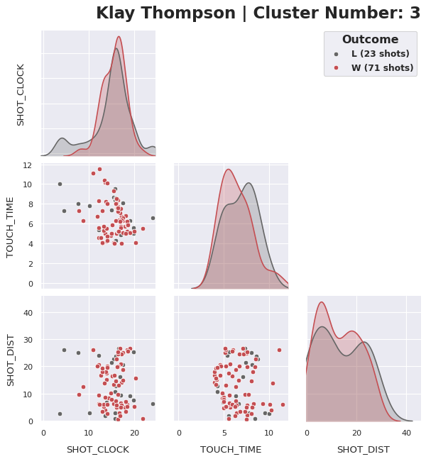
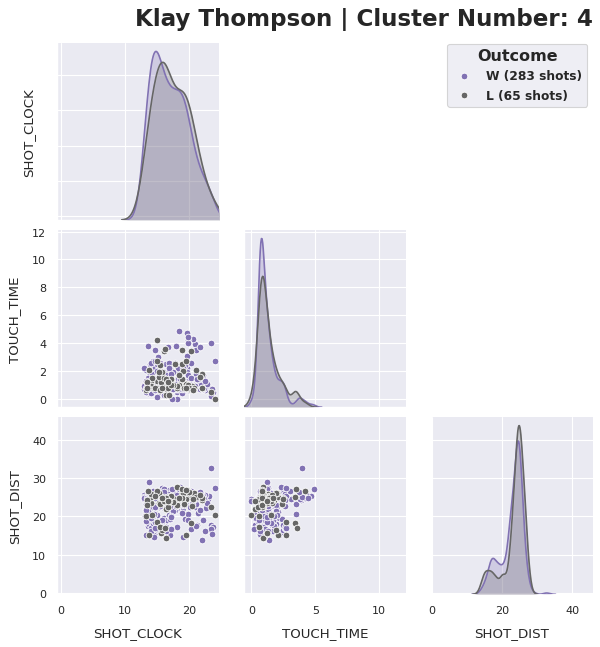
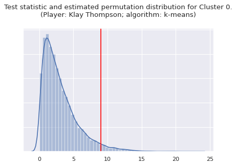

# Player: Klay Thompson

We analyze Klay Thompsons's shots. We drop the variable DRIBBLES, partially out of a desire for simplicity, and partially because DRIBBLES is generally a more discriminative feature for centers and other players who spend more time close to the basket.

## k-Means Clustering and Visualization


```
# Compare Davies–Bouldin indices (small values are better)
```

    k           2         3         4         5         6
    DBI  1.220501  1.066686  1.044042  1.013357  1.077051
    Best k is 5.


```
# Compare silhouette scores (larger values are better)
```

    k                        2         3         4         5         6
    Silhouette Score  0.374051  0.311569  0.347482  0.352166  0.304158
    Best k is 2.


```
# Choose k using Davies-Bouldin
```

    Fit k-means with k = 5.





We give a verbal description of the clusters.
  - Cluster 0: two-pointers taken early in the possession after Klay had handled the ball for less than 5 seconds.
  - Cluster 1: longer-range shots (mostly three-pointers) taken later in the possession (i.e., with less time on the shot clock).
  - Cluster 2: shorter-range shots taken earlier in the possession.
  - Cluster 3: shots taken earlier in the possession, where Klay had handled the ball for a longer period of time (it is likely that he initiated the possession, possibly by getting a rebound).
  - Cluster 4: three-pointers taken earlier in the possesion. 


<link rel=stylesheet type=text/css href='/nbextensions/google.colab/tabbar.css'></link>


| Cluster 0 | Cluster 1 | Cluster 2 | Cluster 3 | Cluster 4 |
| --------- | --------- | --------- | --------- | --------- | 
|  |  |  |  |  |


## Significance testing clusters in wins vs losses using R.

There is noticeable variation within Cluster 0 between wins and losses. We conduct a test of the statistical significance of this variation. We choose the default significance level of 0.05 and conduct a permutation test. Since it is impossible to compute all of the relevant permutations (there are around 10^297 of them), we generate 10,000 at random to estimate the true p-value, then give a confidence interval for this estimation.


```
%%time
perm_test_one_cluster(pf, kmeans_labels, i=0, num_perms=10000)
```

    Performing significance test with alpha = 0.05.
    Cluster 0 has estimated p-value: 0.0358.
    A 99% confidence interval for this p-values is (0.03574, 0.03589).
    CPU times: user 1min 58s, sys: 1min 22s, total: 3min 21s
    Wall time: 1min 42s





Inspecting the plot of Cluster 0, we see that, in wins, the shots tend to be taken from a shorter distance earlier in the possession. In summary, our statistical test has shown us:

> There is a significant difference, in wins and losses, in the type of early-clock two-pointers taken by Klay Thompson.

We note right away that we have not established causality. Nonetheless, the result is intriguing and potentially useful useful in game planning. Concretely, it suggests the importance of emphasizing interior defense. This is slightly surprising, since Thompson is one of the most talented three point shooters in the history of the NBA, and his team, the Warriors, is famous for winning by emphasizing long range shooting.


