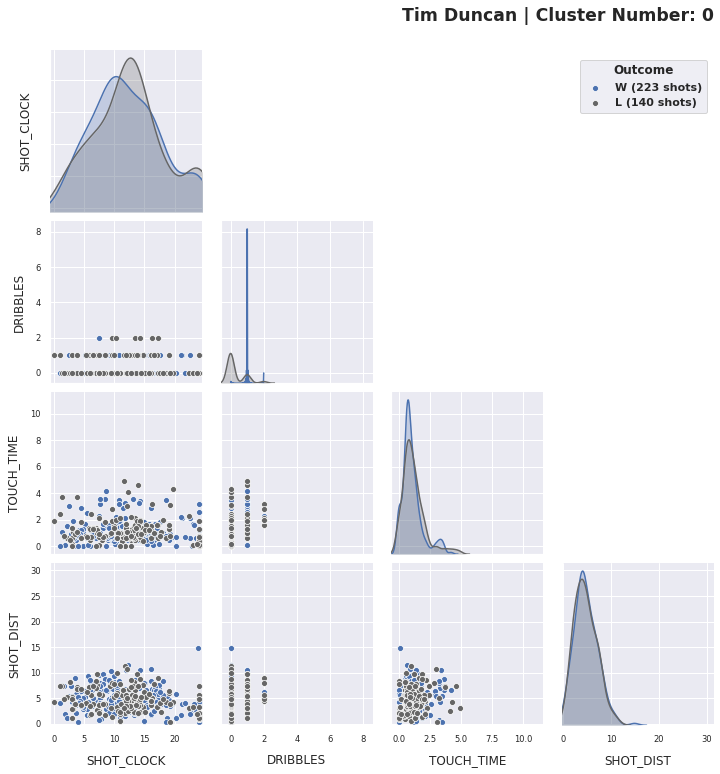

# Player: Tim Duncan

## k-Means Clustering and Visualization


```
# Compare Davies–Bouldin indices (small values are better)
```

    k           2         3         4         5         6
    DBI  0.926039  0.912572  0.923789  0.965842  0.983271
    Best k is 3.


```
# Compare silhouette scores (larger values are better)
```

    k                        2         3         4         5         6
    Silhouette Score  0.440305  0.416033  0.359942  0.354986  0.335902
    Best k is 2.


We don't know whether we should taken k=2 or k=3, so we try out both.


```
    Fit k-means with k = 2.
```


```
    Fit k-means with k = 3.
```


Comparing the two plots, it seems that, roughly speaking, increasing k from 2 to 3 allows Cluster 0 to split into two pieces, which become Cluster 0 and Cluster 1 in the k=3 plot. This has allowed for clusters that overlap less in the SHOT_DIST domain. We interpret the three clusters:
 - Cluster 0: shots taken early in the possession, closer to the basket;
 - Cluster 1: shots taken earlier in the possession from near the three-point line (but mostly long two-pointers);
 - Cluster 2: shots where Duncan handles the ball longer; these tend to end in a midrange shot.


```
# Plot all clusters, comparing wins and losses.
```

| Cluster 0 | Cluster 1 | Cluster 2 |
| --------- | --------- | --------- | 
|  |  | |

## Significance testing clusters in wins vs losses using R.

We see potentially significant variation in the plots of Cluster 0 and Cluster 2.

In Cluster 0 (early possession shots closer to the basket), we see that, in wins, Duncan more often takes one dribble before shooting.

In Cluster 2 (midrange shots following a longer touch time), the shots in wins tend to be a couple of feet closer to the basket (more like 8ft than 10ft), and a couple of seconds sooner (Duncan has handled the ball for around 5s, rather than 7s).

We test Cluster 2, in part because the the interpretation is a bit more actionable.


```
%%time
_ = perm_test_one_cluster(pf, kmeans_labels, i=2, num_perms=10000)
```

    Performing significance test with alpha = 0.05.
    Cluster 2 has estimated p-value: 0.2815.
    A 99% confidence interval for this p-value is (0.2814, 0.28161).
    CPU times: user 1min 57s, sys: 1min 27s, total: 3min 24s
    Wall time: 1min 43s


The p-value is large (0.2815), so we do not conclude that the observed difference is statistically significant. Nonetheless, the visualizations produced above are a useful aid in understanding Duncan's shot profile.
